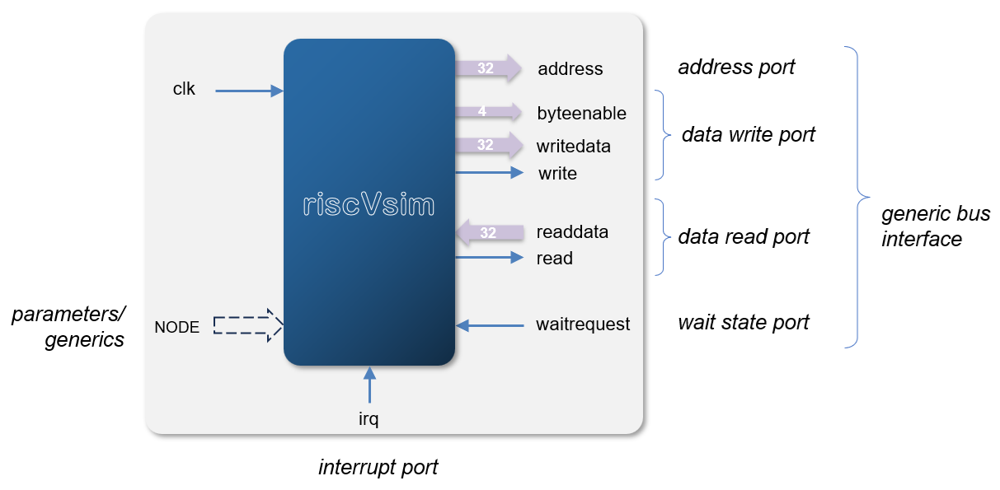

# rv32 ISS Verilog co-simulation module

This folder contains a Verilog component suitable for compilation into a logic simulator.

## Compilation steps

The _rv32_ model can be compiled to a library (`librv32.a`) with the `makefile` in the `iss`
directory. Some _VProc_ integrartion user code is then required to configure and run the model,
with a defined _rv32_ external memory callback function to make calls to the _VProc_ API
to instigate transacton on the Verilog instantiated component. This interation code, along
with options to link the `librv32.a` library is passed to the _VProc_ test `makefile` to
generated the `VProc.so` shared object to be loaded at runtime by the logic simulator. An example
set of integration code and compilation `makefile` is provided in the `test` directory for
_QuestaSim_.

## Verilog Component

The Verilog component in  `verilog/riscVsim.v`

